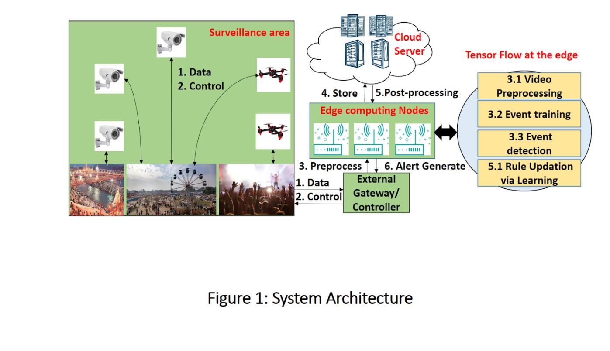

# TensorFlow at the Edge for Wireless Drones

The adoption of deep learning at Edge computing has made the technology for the safety and monitoring of crowd in the real-time on-the-fly. The challenges are to design a deep learning pipeline at the low-resource devices at the edge. This project focuses on developing scalable, deep learning-based Edge computing using TensorFlow and OpenCV to compute and perform video processing using the Raspberry Pi.

### The key objectives of this project are:

- Developing deep learning using TensorFlow.
- Apply the Video processing algorithms to monitor and detect a person in a video stream.
- Minimize the cloud garbage and workload by computing at edge devices and storing useful data only.

### Inspiration:

In recent days IoT technology leading us to the post-cloud era. Smart connected devices generate a huge amount of data. Nowadays, the real-time video data dominate the online traffic and create heavy workload in a communication network. By 2021 74% of the online data will be videos. So, it should be avoided to send insignificant raw data towards the cloud. Moreover, transmitting raw footage is crucial for delay sensitive and mission-critical applications. To reduce workload in communication network real-time data processing and decision making should be done at the edge of the network. Only significant information regarding processed data should be sent to the data center. The major advantages of using edge over the cloud are the reduction of overload, real-time decision making, fault tolerance, reduction of global network traffic, etc.

### Working:

Here we have developed a smart and efficient system using deep learning, edge computing, and cloud technologies. Instead of using only a centralized cloud server, the functions including feature engineering and decision making are moved to the network edge creating a distributed environment. In Figure 1 below, we have focused on parts 1 - 4, 5 & 6 being application/use dependent.

**Step1:**
First, the real-time video stream will be captured by the pi camera mounted on a raspberry pi (edge device).

**Step2:**
Feature engineering will be done at the Edge using TensorFlow and OpenCV framework, a Deep learning model already trained on the preprocessed data and deployed on Google Cloud Platform.

**Step3:**
The trained model will identify “persons” in the video efficiently and Edge devices will send only the information regarding identified persons to the cloud while avoid sending of insignificant raw data.

### Technologies Used:

**1. Raspberry Pi:** The Raspberry Pi is a series of small single-board computers. Raspberry Pi 3 Model B is equipped with a 1.2 GHz 64-bit quad core processor, onboard WIFI, Bluetooth and USB boot capabilities.

**2. Raspbian:** Raspbian is a Debian-based computer operating system for Raspberry Pi.

**3. TensorFlow:** TensorFlow is an end-to-end open source platform for machine learning. It has a comprehensive, flexible ecosystem of tools, libraries and community resources that lets researchers push the state-of-the-art in ML and developers easily build and deploy ML powered applications.

**4. OpenCV:** OpenCV (Open Source Computer Vision Library) is an open source computer vision and machine learning software library. OpenCV was built to provide a common infrastructure for computer vision applications. The library has more than 2500 optimized algorithms, which includes a comprehensive set of both classic and state-of-the-art computer vision and machine learning algorithms. These algorithms can be used to detect and recognize faces, identify objects, classify human actions in videos, track camera movements, etc.

**5. Google Cloud Platform:** Google Cloud Platform (GCP), offered by Google, is a suite of cloud computing services that runs on the same infrastructure that Google uses internally for its end-user products, such as Google Search and YouTube. Alongside a set of management tools, it provides a series of modular cloud services including computing, data storage, data analytics, and machine learning. Google Cloud Platform provides infrastructure as a service, platform as a service, and serverless computing environments.

### Contributers:
Sheetal Gupta 
Shivansh Shukla
Anubhav Jangra

